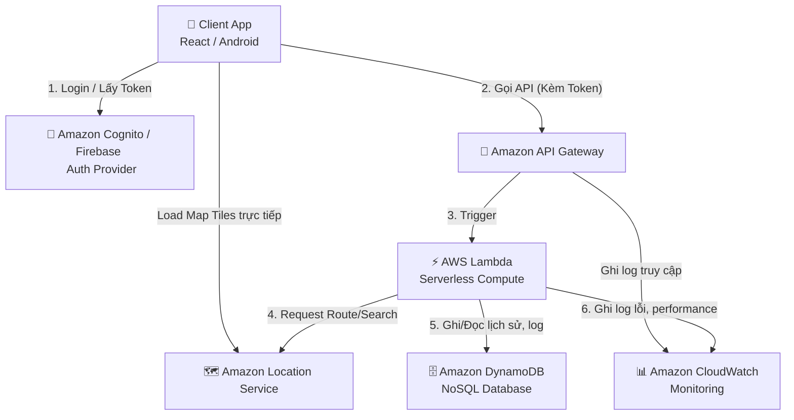
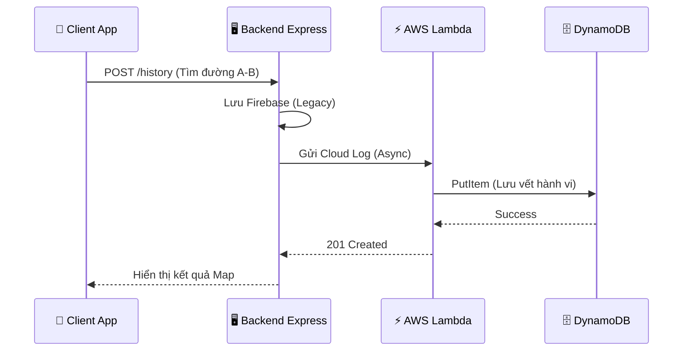

# TIỂU LUẬN: NGHIÊN CỨU VÀ TRIỂN KHAI HỆ THỐNG BẢN ĐỒ THÔNG MINH DỰA TRÊN KIẾN TRÚC SERVERLESS CỦA AWS

**Học phần:** Điện toán đám mây (Cloud Computing)  
**Sinh viên thực hiện:** [HỌ TÊN CỦA BẠN]  
**Mã số sinh viên:** [MSSV CỦA BẠN]  

---

## LỜI CẢM ƠN

Đầu tiên, em xin gửi lời tri ân chân thành nhất tới Thầy, người đã trực tiếp giảng dạy và dẫn dắt em trong suốt học phần Điện toán đám mây vừa qua.

Những bài giảng đầy tâm huyết của Thầy không chỉ dừng lại ở các khái niệm lý thuyết khô khan, mà đã thực sự mở ra cho em một tư duy mới về cách vận hành hệ thống hiện đại trên nền tảng Cloud. Chính những kiến thức về kiến trúc Serverless, khả năng tự động mở rộng và quản trị tài nguyên mà Thầy truyền đạt đã trở thành nguồn cảm hứng lớn nhất giúp em hoàn thành dự án này.

Em đặc biệt trân trọng những buổi thực hành và sự tận tâm của Thầy trong việc giải đáp từng vướng mắc kỹ thuật, tạo điều kiện tối đa để chúng em được tiếp cận với các công nghệ thực tiễn nhất. Những kinh nghiệm quý báu này chắc chắn sẽ là hành trang không thể thiếu trên con đường phát triển sự nghiệp của em sau này.

Một lần nữa, em xin kính chúc Thầy luôn dồi dào sức khỏe, giữ mãi ngọn lửa đam mê với sự nghiệp giáo dục và gặt hái được nhiều thành công mới trong công tác nghiên cứu. 

**Trân trọng cảm ơn Thầy!**

---

## LỜI MỞ ĐẦU

Trong kỷ nguyên chuyển đổi số, các hệ thống thông tin địa lý (GIS) và bản đồ trực tuyến đã trở thành một phần không thể thiếu, đóng vai trò then chốt trong việc tìm đường, quản lý hạ tầng và hỗ trợ các dịch vụ logictics hiện đại. Sự bùng nổ của dữ liệu vị trí đòi hỏi các hệ thống này không chỉ chính xác mà còn phải có khả năng mở rộng linh hoạt và độ tin cậy cao.

Xuất phát từ thực tiễn đó, em đã lựa chọn đề tài: **“NGHIÊN CỨU VÀ TRIỂN KHAI HỆ THỐNG BẢN ĐỒ THÔNG MINH DỰA TRÊN KIẾN TRÚC SERVERLESS CỦA AWS”**. Mục tiêu của đề tài là xây dựng một ứng dụng bản đồ hiện đại, cho phép hiển thị, tìm kiếm và tính toán tuyến đường, đồng thời vận hành cơ chế quản lý và phân tích dữ liệu tập trung trên nền tảng đám mây.

Điểm đặc biệt của dự án này là việc vận dụng linh hoạt **Amazon Location Service** kết hợp với kiến trúc **Serverless (AWS Lambda, API Gateway, DynamoDB)**. Qua đó, hệ thống không chỉ giải quyết được bài toán về tính năng mà còn thể hiện ưu thế vượt trội của Điện toán đám mây trong việc tối ưu hóa tài nguyên và chi phí vận hành.

Mặc dù đã dành nhiều tâm huyết để hoàn thiện, nhưng do giới hạn về thời gian và kiến thức, đề tài chắc chắn không tránh khỏi những thiếu sót nhất định. Em rất mong nhận được những ý kiến đóng góp và phê bình từ Thầy để hệ thống có thể hoàn thiện và ứng dụng thực tiễn tốt hơn trong tương lai.

**Trân trọng cảm ơn Thầy!**

---

## CHƯƠNG 1: GIỚI THIỆU ĐỀ TÀI

### 1.1. Lý do chọn đề tài
Trong kỷ nguyên công nghiệp 4.0, Điện toán đám mây (Cloud Computing) đã trở thành hạ tầng cốt lõi cho mọi ứng dụng hiện đại. Việc chuyển dịch từ mô hình máy chủ truyền thống (On-premise) sang Cloud giúp doanh nghiệp tối ưu hóa chi phí, tăng khả năng mở rộng và tính sẵn sàng cao. Đề tài "Hệ thống bản đồ thông minh trên nền tảng AWS" được lựa chọn nhằm mục tiêu nghiên cứu và vận hành thực tế các dịch vụ hiện đại nhất của Amazon Web Services (AWS) như Serverless, NoSQL và Location Service.

### 1.2. Mục tiêu hệ thống

#### 1.2.1. Mục tiêu tổng quát
Nghiên cứu và hiện thực hóa việc ứng dụng các dịch vụ Cloud-Native của Amazon Web Services (AWS) để xây dựng một hệ thống bản đồ thông minh, hỗ trợ đa nền tảng, có khả năng xử lý dữ liệu quy mô lớn và tối ưu hóa chi phí vận hành thông qua kiến trúc Serverless.

#### 1.2.2. Mục tiêu cụ thể
*   **Về mặt tính năng (Functional Goals):**
    *   Xây dựng giao diện tương tác bản đồ mượt mà trên cả hai nền tảng phổ biến là Web (ReactJS) và Mobile (Android).
    *   Tích hợp bộ giải pháp của **Amazon Location Service** để thực hiện các tính năng: Hiển thị bản đồ (Maps), Tìm kiếm địa chỉ (Geocoding) và Tính toán tuyến đường tối ưu (Routing).
    *   Cung cấp tính năng quản lý dữ liệu cá nhân hóa như: Lưu trữ địa điểm yêu thích và truy xuất lịch sử hành trình.

*   **Về mặt kiến trúc và công nghệ (Technical Goals):**
    *   **Triển khai mô hình Hybrid Cloud:** Vận hành song song hệ thống di sản (Legacy) dựa trên Firebase và kiến trúc hiện đại (Modern) dựa trên AWS Serverless, thể hiện khả năng tích hợp và chuyển đổi linh hoạt của hệ thống.
    *   **Xây dựng luồng Cloud Logging:** Tự động thu thập và lưu trữ mọi vết request (userId, tọa độ, nội dung tìm kiếm) từ phía người dùng vào cơ sở dữ liệu **Amazon DynamoDB** thông qua **AWS Lambda**.
    *   **Hiện thực hóa tính năng Cloud Analytics:** Sử dụng các truy vấn NoSQL trên đám mây để thống kê và phân tích các địa điểm "nóng" (Hotspots), từ đó đưa ra các báo cáo về hành vi người dùng thời gian thực.

*   **Về mặt quản trị và tối ưu (Management Goals):**
    *   Áp dụng mô hình **Event-Driven Architecture** (Kiến trúc hướng sự kiện) để tối ưu hóa hiệu năng xử lý của backend.
    *   Tận dụng mô hình thanh toán **Pay-as-you-go** của AWS để giảm thiểu chi phí đầu tư hạ tầng ban đầu.
    *   Đảm bảo tính bảo mật hệ thống thông qua việc quản lý định danh và quyền truy cập chặt chẽ với **AWS IAM (Identity and Access Management)**.

---

## CHƯƠNG 2: CƠ SỞ LÝ THUYẾT

### 2.1. Tổng quan về Điện toán đám mây và AWS
*   **Khái niệm:** Điện toán đám mây (Cloud Computing) là mô hình cung cấp tài nguyên máy tính qua Internet với khả năng truy cập tức thì và thanh toán linh hoạt.
*   **Mô hình dịch vụ:** Đề tài vận dụng mô hình **PaaS (Platform as a Service)** và **BaaS (Backend as a Service)** để giảm thiểu gánh nặng quản lý hạ tầng.
*   **Sơ đồ so sánh trách nhiệm quản trị hạ tầng:**

```mermaid
graph TD
    subgraph "Mô hình Truyền thống"
        A1[Ứng dụng & Dữ liệu]
        A2[Runtime & Hệ điều hành]
        A3[Server & Hạ tầng vật lý]
        A1 --- A2 --- A3
        style A1 fill:#f96,stroke:#333
        style A2 fill:#f96,stroke:#333
        style A3 fill:#f96,stroke:#333
    end

    subgraph "Mô hình IaaS (EC2)"
        B1[Ứng dụng & Dữ liệu]
        B2[Runtime & Hệ điều hành]
        B3[Server & Hạ tầng vật lý]
        B1 --- B2 --- B3
        style B1 fill:#f96,stroke:#333
        style B2 fill:#f96,stroke:#333
        style B3 fill:#9cf,stroke:#333
    end

    subgraph "Mô hình Serverless (PaaS/BaaS)"
        C1[Ứng dụng & Dữ liệu]
        C2[Runtime & Hệ điều hành]
        C3[Server & Hạ tầng vật lý]
        C1 --- C2 --- C3
        style C1 fill:#f96,stroke:#333
        style C2 fill:#9cf,stroke:#333
        style C3 fill:#9cf,stroke:#333
    end

    %% Chú thích
    subgraph "Chú thích"
        D1[Cam: SV tự quản lý]
        D2[Xanh: AWS quản lý]
        style D1 fill:#f96
        style D2 fill:#9cf
    end
```



*   **Đặc tính cốt lõi:**
    *   **Scalability (Khả năng mở rộng):** Khả năng tự động điều chỉnh tài nguyên theo nhu cầu thực tế.
    *   **High Availability (Tính sẵn sàng cao):** Dữ liệu và dịch vụ được duy trì liên tục trên nhiều hạ tầng vật lý của AWS.
    *   **Cost Optimization:** Sử dụng mô hình **Pay-as-you-go**, giúp tối ưu hóa chi phí vận hành.

### 2.2. Kiến trúc Serverless và Mô hình hướng sự kiện (Event-Driven)
*   **Serverless Architecture:** Là kiến trúc loại bỏ việc quản trị máy chủ vật lý. AWS tự động thực hiện các tác vụ như vá lỗi bảo mật, duy trì mạng và cấp phát bộ nhớ.
*   **FaaS (Function as a Service):** Được thể hiện qua **AWS Lambda**. Đây là các hàm xử lý mã nguồn độc lập, chỉ được kích hoạt khi có sự kiện (Event) xảy ra và tự động tắt khi hoàn tất tác vụ (Scale to zero).
*   **Event-Driven Model:** Hệ thống được thiết kế để phản ứng với các hành động của người dùng (như tìm kiếm, lưu yêu thích) như các sự kiện kích hoạt luồng xử lý dữ liệu.

### 2.3. Công nghệ Cơ sở dữ liệu NoSQL (Amazon DynamoDB)
*   **Amazon DynamoDB:** Là dịch vụ cơ sở dữ liệu NoSQL quản trị hoàn toàn, cung cấp hiệu năng ổn định ở mọi quy mô.
*   **Đặc điểm kỹ thuật:** Lưu trữ dữ liệu dưới dạng **Key-Value** hoặc **Document**. Cấu trúc này cho phép mở rộng ngang (Horizontal Scaling) không giới hạn mà không làm giảm tốc độ truy xuất.
*   **Schema Design:** Sử dụng cơ chế Partition Key (Khóa phân vùng) và Sort Key (Khóa sắp xếp) để tối ưu hóa việc lưu trữ log lịch sử và truy vấn analytics.

### 2.4. Dịch vụ vị trí Amazon (Amazon Location Service)
*   **Maps & Places:** Cung cấp Map Tiles chất lượng cao và khả năng Geocoding mạnh mẽ.
*   **Routes:** API tính toán đường đi dựa trên dữ liệu giao thông thực tế, hỗ trợ nhiều phương thức di chuyển.
*   **Security:** Tích hợp với **AWS IAM** để quản lý quyền truy cập thông qua các chính sách (Policies) bảo mật nghiêm ngặt.

### 2.5. Ngôn ngữ và Công nghệ lập trình sử dụng
Hệ thống là sự kết hợp của các ngôn ngữ và framework hiện đại nhằm tối ưu hóa trải nghiệm người dùng:
*   **Javascript (Node.js):** Sử dụng cho Backend Serverless (Lambda) và Logic ứng dụng Web.
*   **Kotlin:** Ngôn ngữ chủ đạo cho ứng dụng Android, giúp tối ưu hóa hiệu năng và tích hợp tốt với SDK của AWS.
*   **ReactJS:** Thư viện Javascript xây dựng giao diện Web theo hướng thành phần (Component-based), giúp UI mượt mà và linh hoạt.
*   **MapLibre SDK:** Thư viện nguồn mở giúp hiển thị bản đồ dựa trên Vector Tiles từ AWS.

---

## CHƯƠNG 3: PHÂN TÍCH VÀ THIẾT KẾ HỆ THỐNG

### 3.1. Sơ đồ Use Case
Mô tả các chức năng cốt lõi mà người dùng có thể tương tác với hệ thống.

```mermaid
useCaseDiagram
    actor "Người dùng" as User
    actor "Hệ thống AWS" as AWS

    package "Smart Map System" {
        usecase "Tìm kiếm địa điểm" as UC1
        usecase "Tính toán đường đi" as UC2
        usecase "Lưu yêu thích" as UC3
        usecase "Ghi log Cloud (DynamoDB)" as UC4
        usecase "Phân tích Analytics" as UC5
    }

    User --> UC1
    User --> UC2
    User --> UC3
    UC1 ..> UC4 : <<include>>
    UC2 ..> UC4 : <<include>>
    UC3 ..> UC4 : <<include>>
    AWS --> UC5
```

### 3.2. Sơ đồ Kiến trúc hệ thống (Architecture View)
Hệ thống được thiết kế theo mô hình Cloud-Native, tận dụng tối đa các dịch vụ quản trị của AWS để đảm bảo tính sẵn sàng và khả năng mở rộng.



### 3.3. Sơ đồ Luồng dữ liệu (Sequence Diagram)
Quy trình từ lúc người dùng thực hiện một yêu cầu tìm kiếm đến khi dữ liệu được lưu trữ trên Cloud.



---

## CHƯƠNG 4: CÀI ĐẶT VÀ KẾT QUẢ

### 4.1. Cấu hình hạ tầng AWS
Hệ thống được thiết lập qua các bước:
1. Tạo bảng **DynamoDB** với Partition Key là `userId` và Sort Key là `requestId`.
2. Viết hàm **Lambda** bằng Node.js để xử lý dữ liệu đầu vào và ghi vào bảng.
3. Thiết lập **API Gateway** làm điểm cuối (Endpoint) để backend giao tiếp.

### 4.2. Mã nguồn Lambda xử lý Logging
Mã nguồn sử dụng AWS SDK v3 để tối ưu hóa hiệu năng thực thi:

```javascript
import { DynamoDBClient } from "@aws-sdk/client-dynamodb";
import { DynamoDBDocumentClient, PutCommand } from "@aws-sdk/lib-dynamodb";

export const handler = async (event) => {
    // Logic: Nhận data từ API Gateway -> Chuẩn hóa -> Ghi DynamoDB
    // Giúp tách biệt hoàn toàn logic logging khỏi server chính.
};
```

### 4.3. Kết quả Demo
- **Trên Web/Android**: Khi thực hiện tìm kiếm, người dùng nhận được chỉ dẫn đường đi tức thì.
- **Trên AWS Console**: Dữ liệu lịch sử được ghi lại chi tiết trong DynamoDB bao gồm: Tọa độ, nội dung tìm kiếm, thời gian và thiết bị sử dụng.
- **Analytics**: Thông qua hàm Lambda Analytics, quản trị viên có thể xem thống kê các địa điểm được quan tâm nhất hệ thống.

---

## KẾT LUẬN
Đề tài đã hoàn thành việc xây dựng một hệ thống bản đồ thông minh vận hành trên nền tảng AWS Serverless. Qua quá trình thực hiện, sinh viên đã nắm vững:
- Cách vận hành các dịch vụ cốt lõi của AWS.
- Tư duy thiết kế hệ thống theo hướng Event-Driven.
- Kỹ năng xử lý dữ liệu trên NoSQL và tối ưu hóa chi phí vận hành đám mây.

**Hướng phát triển:** Tích hợp Real-time tracking và AI gợi ý tuyến đường dựa trên dữ liệu lịch sử đã thu thập được trong DynamoDB.
