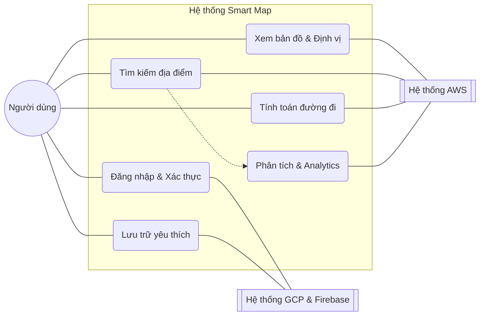
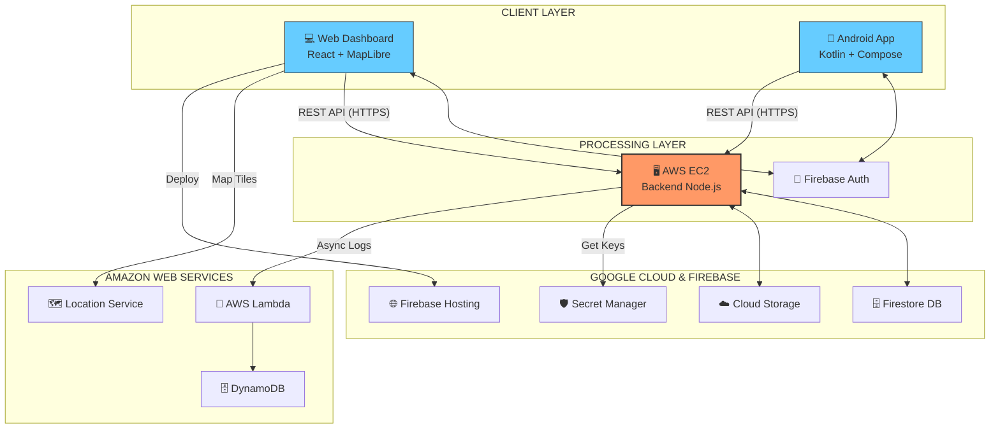
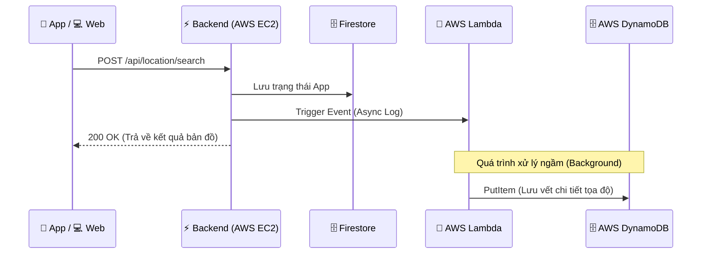
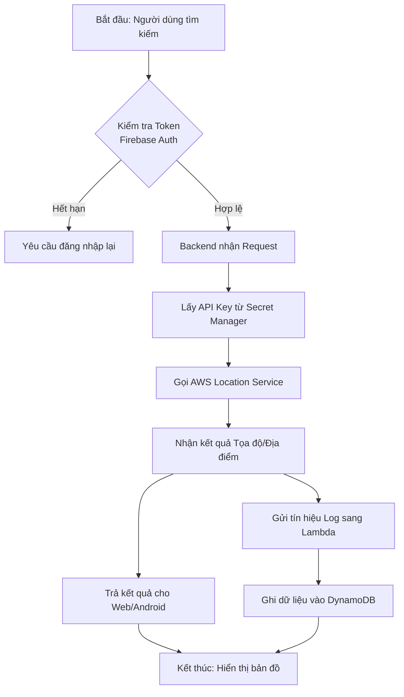
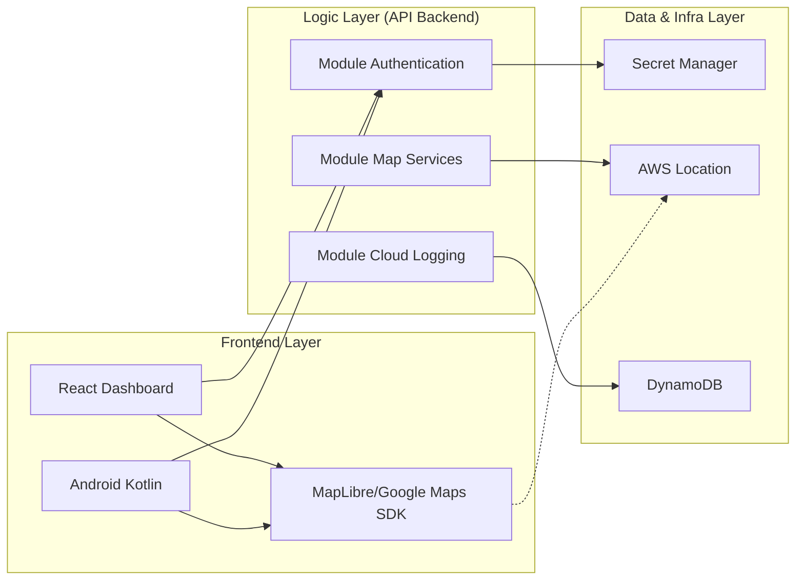
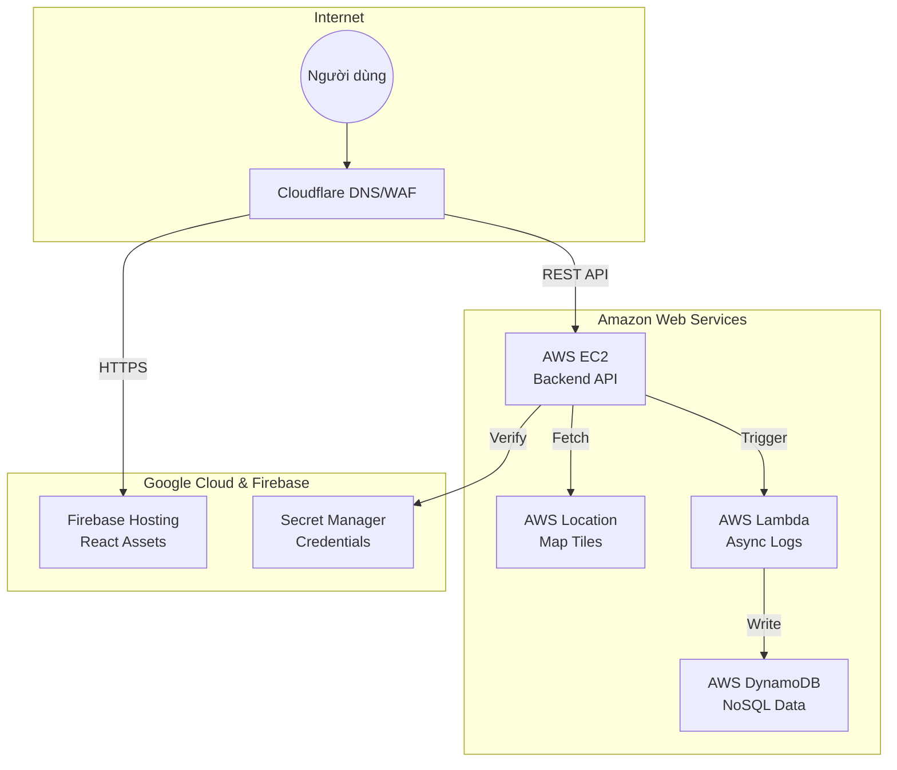
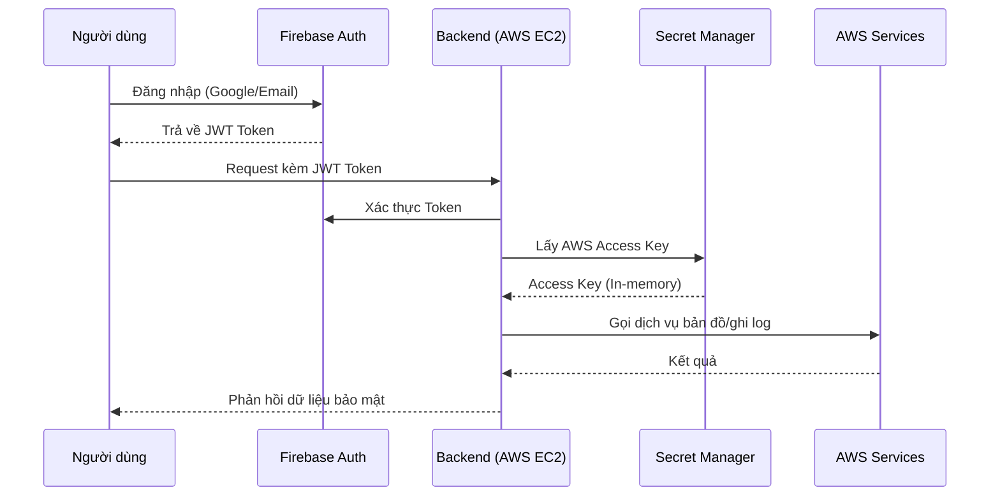

# TIỂU LUẬN: NGHIÊN CỨU VÀ TRIỂN KHAI HỆ THỐNG BẢN ĐỒ THÔNG MINH ĐA ĐÁM MÂY (MULTI-CLOUD: AWS & GCP)

**Học phần:** Điện toán đám mây (Cloud Computing)  
**Sinh viên thực hiện:** Lê Nguyễn Duy Cường  
**Mã số sinh viên:** [MSSV CỦA BẠN]  

---

## LỜI CẢM ƠN

Đầu tiên, em xin gửi lời tri ân chân thành nhất tới Thầy, người đã trực tiếp giảng dạy và dẫn dắt em trong suốt học phần Điện toán đám mây vừa qua.

Những bài giảng đầy tâm huyết của Thầy không chỉ dừng lại ở các khái niệm lý thuyết khô khan, mà đã thực sự mở ra cho em một tư duy mới về cách vận hành hệ thống hiện đại trên nền tảng Cloud. Chính những kiến thức về kiến trúc Serverless, khả năng tự động mở rộng, quản trị tài nguyên và đặc biệt là cách kết hợp các dịch vụ đám mây (AWS, GCP) mà Thầy truyền đạt đã trở thành nguồn cảm hứng lớn nhất giúp em hoàn thành dự án này.

Em đặc biệt trân trọng những buổi thực hành và sự tận tâm của Thầy trong việc giải đáp từng vướng mắc kỹ thuật, tạo điều kiện tối đa để chúng em được tiếp cận với các công nghệ thực tiễn nhất. Những kinh nghiệm quý báu này chắc chắn sẽ là hành trang không thể thiếu trên con đường phát triển sự nghiệp của em sau này.

Một lần nữa, em xin kính chúc Thầy luôn dồi dào sức khỏe, giữ mãi ngọn lửa đam mê với sự nghiệp giáo dục và gặt hái được nhiều thành công mới trong công tác nghiên cứu. 

**Trân trọng cảm ơn Thầy!**

---

## LỜI MỞ ĐẦU

Trong kỷ nguyên chuyển đổi số, các hệ thống thông tin địa lý (GIS) và bản đồ trực tuyến đã trở thành một phần không thể thiếu, đóng vai trò then chốt trong việc tìm đường, quản lý hạ tầng và hỗ trợ các dịch vụ logistics hiện đại. Sự bùng nổ của dữ liệu vị trí đòi hỏi các hệ thống này không chỉ chính xác mà còn phải có khả năng mở rộng linh hoạt, độ tin cậy cao và tối ưu hóa chi phí.

Xuất phát từ thực tiễn đó, em đã lựa chọn đề tài: **“NGHIÊN CỨU VÀ TRIỂN KHAI HỆ THỐNG BẢN ĐỒ THÔNG MINH ĐA ĐÁM MÂY (MULTI-CLOUD: AWS & GCP)”**. Mục tiêu của đề tài là xây dựng một hệ sinh thái ứng dụng bản đồ hiện đại đa nền tảng (Web & Android), cho phép theo dõi vị trí, định vị thời gian thực, tìm kiếm và phân tích dữ liệu tập trung trên nền tảng đám mây.

Điểm đặc biệt của dự án này là việc vận dụng linh hoạt **kiến trúc Multi-Cloud**, kết hợp sức mạnh phân tích và bản đồ từ **AWS (Amazon Location Service, Lambda, DynamoDB)** cùng khả năng triển khai, vận hành trực tuyến từ **Google Cloud Platform / Firebase (AWS EC2, Secret Manager, Cloud Storage, Firestore)**. Qua đó, hệ thống không chỉ dừng lại ở mức độ chạy dưới máy cục bộ (Local) mà đã được **triển khai thực tế trên Internet** thông qua các quy trình đóng gói container và hosting chuyên nghiệp, giúp giải quyết bài toán về tính năng hiện đại và tối ưu hóa hiệu năng, chi phí.

Mặc dù đã dành nhiều tâm huyết để hoàn thiện, nhưng do giới hạn về thời gian và kiến thức, báo cáo chắc chắn không tránh khỏi những thiếu sót nhất định. Em rất mong nhận được những ý kiến đóng góp và phê bình từ Thầy để hệ thống có thể hoàn thiện và ứng dụng thực tiễn tốt hơn trong tương lai.

**Trân trọng cảm ơn Thầy!**

---

## CHƯƠNG 1: GIỚI THIỆU ĐỀ TÀI

### 1.1. Lý do chọn đề tài
Trong kỷ nguyên công nghiệp 4.0, Điện toán đám mây (Cloud Computing) đã trở thành hạ tầng cốt lõi. Đặc biệt, xu hướng **Multi-Cloud (Đa đám mây)** đang lên ngôi, cho phép các hệ thống tận dụng tối đa những dịch vụ ưu việt nhất từ các nhà cung cấp khác nhau để tránh bị phụ thuộc (vendor lock-in) và tối ưu hóa chi phí. Đề tài "Hệ thống bản đồ thông minh đa đám mây" được lựa chọn nhằm nghiên cứu, tích hợp và vận hành thực tế các dịch vụ tiên tiến của cả **Amazon Web Services (AWS)** và **Google Cloud Platform (GCP)**.

### 1.2. Mục tiêu hệ thống

#### 1.2.1. Mục tiêu tổng quát
Thiết kế và triển khai hệ sinh thái bản đồ đa nền tảng (Smart Map Cloud Analytics), ứng dụng các mô hình Serverless và Cloud-Native của AWS và GCP để đảm bảo tính sẵn sàng cao, hiệu năng lớn và phân tích dữ liệu thời gian thực.

#### 1.2.2. Mục tiêu cụ thể
*   **Về mặt tính năng (Functional Goals):**
    *   **Bản đồ tương tác & Định vị thời gian thực:** Cung cấp trải nghiệm mượt mà trên Web Dashboard (React) và thiết bị di động (Android).
    *   **Quản lý người dùng:** Đăng nhập, xác thực an toàn bằng hệ thống Firebase Authentication (Google & Email/Password).
    *   **Tìm kiếm & Chỉ đường:** Ứng dụng bản đồ số chuyên sâu để tìm địa điểm và đường đi.
    *   **Cloud Analytics Dashboard:** Tổng hợp và thống kê dữ liệu tọa độ, lịch sử tìm kiếm để phân tích hành vi người dùng và các địa điểm "nóng" (Hotspots).

*   **Về mặt kiến trúc và công nghệ (Technical Goals):**
    *   **Triển khai kiến trúc Multi-Cloud (GCP & AWS):** 
        *   Sử dụng **AWS EC2 (Backend Node.js)** làm nền tảng Backend chính chạy Node.js.
        *   Tận dụng **AWS Location Service**, **AWS Lambda** và **DynamoDB** cho luồng Cloud Analytics và bản đồ.
    *   **Xử lý bất đồng bộ (Asynchronous Processing):** Tối ưu hiệu năng hệ thống bằng cách tách biệt luồng ghi log sang **AWS Lambda**, đảm bảo backend chính không bị tắc nghẽn khi xử lý dữ liệu lớn.
    *   **Lưu trữ & Dữ liệu:** Kết hợp Firebase Firestore (dữ liệu thời gian thực), AWS DynamoDB (lưu trữ logs dạng NoSQL) và Google Cloud Storage (quản lý tệp tin).
    *   **Triển khai & Vận hành thực tế (Deployment):** Đưa hệ thống lên Internet sử dụng **Docker** đóng gói Backend, **Firebase Hosting** phân phối Web và **Cloudflare** quản lý DNS/Bảo mật.

*   **Về mặt quản trị và tối ưu (Management Goals):**
    *   **Bảo mật:** Quản lý Secrets tập trung với **GCP Secret Manager** và bảo vệ hạ tầng bằng **Cloudflare WAF/DDoS Protection**.
    *   **Tối ưu chi phí:** Vận hành theo mô hình **Serverless (Pay-as-you-go)**, tự động mở rộng (Autoscaling) và giảm tài nguyên về 0 khi không sử dụng.

---

## CHƯƠNG 2: CƠ SỞ LÝ THUYẾT VÀ CÔNG NGHỆ ÁP DỤNG

### 2.1. Tổng quan về Điện toán đám mây (Cloud Computing)
*   **Khái niệm:** Điện toán đám mây là mô hình cung cấp các tài nguyên máy tính (máy chủ, lưu trữ, cơ sở dữ liệu, mạng, phần mềm...) thông qua Internet theo yêu cầu, với cơ chế thanh toán linh hoạt (Pay-as-you-go).
*   **Đặc điểm cốt lõi:** 
    *   **On-demand self-service:** Người dùng tự phục vụ tài nguyên khi cần.
    *   **Scalability & Elasticity:** Khả năng mở rộng hoặc thu nhỏ tài nguyên tức thì theo nhu cầu thực tế.
    *   **High Availability:** Đảm bảo hệ thống luôn hoạt động ổn định nhờ hạ tầng phân tán toàn cầu.

### 2.2. Giới thiệu về Amazon Web Services (AWS)
*   **Tổng quan:** AWS là nền tảng điện toán đám mây hàng đầu thế giới của Amazon, cung cấp một hệ sinh thái dịch vụ phong phú từ hạ tầng cơ bản (Compute, Storage) đến các công nghệ tiên tiến (AI, Machine Learning, IoT).
*   **Thế mạnh:** 
    *   **Độ tin cậy:** Hạ tầng trải dài trên nhiều vùng địa lý (Regions) và vùng sẵn sàng (Availability Zones).
    *   **Bảo mật:** Đáp ứng các tiêu chuẩn bảo mật khắt khe nhất toàn cầu.
    *   **Đổi mới:** Liên tục cập nhật các dịch vụ mới nhằm tối ưu hóa quy trình phát triển ứng dụng.

### 2.3. Kiến trúc Đa đám mây (Multi-Cloud) và Serverless
*   **Multi-Cloud:** Dự án kết hợp AWS và GCP để tận dụng thế mạnh riêng biệt: AWS cho các dịch vụ vị trí chuyên sâu và GCP cho nền tảng triển khai container linh hoạt. Điều này giúp hệ thống tránh phụ thuộc vào một nhà cung cấp duy nhất (Vendor lock-in).
*   **Serverless Architecture:** 
    *   **Đặc điểm:** Loại bỏ gánh nặng quản lý server, tự động hóa việc vá lỗi và bảo trì hạ tầng.
    *   **Cơ chế thanh toán:** Áp dụng mô hình **Pay-as-you-go**, chỉ trả phí cho tài nguyên thực sự tiêu thụ (CPU/RAM khi có request).
    *   **Autoscaling:** Khả năng tự động mở rộng từ 0 đến hàng ngàn thực thể (instances) và thu hẹp về 0 khi không có lưu lượng, giúp tối ưu hóa chi phí tuyệt đối.

### 2.4. Dịch vụ Amazon Web Services (AWS) trong dự án
*   **Amazon Location Service:** Tích hợp qua **AWS SDK v3** (phiên bản mới nhất với cấu trúc dạng module giúp tối ưu kích thước ứng dụng). Dịch vụ này cung cấp bản đồ số chính xác, hỗ trợ tìm kiếm địa chỉ và tính toán tuyến đường tối ưu.
*   **Amazon DynamoDB:** Cơ sở dữ liệu NoSQL với khả năng mở rộng ngang không giới hạn. Được sử dụng để lưu trữ logs hành trình nhờ tốc độ ghi cực nhanh (độ trễ tính bằng mili giây).
*   **AWS Lambda:** Hàm Serverless xử lý logic bất đồng bộ (Asynchronous), giúp tách biệt luồng ghi log khỏi luồng xử lý chính của người dùng, nâng cao trải nghiệm ứng dụng.

### 2.5. Dịch vụ Google Cloud Platform (GCP) & Firebase
*   **AWS EC2 (Backend Node.js):** Nền tảng serverless thực thi các Docker container. AWS EC2 cho phép triển khai Backend Node.js một cách nhanh chóng, hỗ trợ HTTPS tự động và quản lý phiên bản (Revision) linh hoạt.
*   **GCP Secret Manager:** Hệ thống quản lý bảo mật tập trung. Dự án sử dụng Secret Manager để lưu trữ an toàn các AWS Access Keys, API Keys và Database Credentials, giúp mã nguồn luôn sạch (Clean Code) và bảo mật cao.
*   **Google Cloud Storage:** Lưu trữ dữ liệu đối tượng (Object Storage), dùng để quản lý các tệp tin hình ảnh, dữ liệu người dùng với độ bền cao.
*   **Firebase Ecosystem:**
    *   **Authentication:** Hệ thống xác thực đa phương thức (Google, Email/Password), tích hợp dễ dàng qua Firebase SDK.
    *   **Firestore:** Cơ sở dữ liệu tài liệu (Document DB) thời gian thực, đồng bộ dữ liệu tức thì giữa Web và Mobile.
    *   **Hosting:** Phân phối ứng dụng Web qua mạng lưới CDN của Google, đảm bảo tốc độ tải trang cực nhanh.

### 2.6. Công cụ triển khai và Quản lý (Deployment Tools)
Để đưa hệ thống từ môi trường phát triển (Local) lên mạng (Production), các công cụ sau đã được sử dụng:
*   **Docker CLI:** Dùng để đóng gói mã nguồn Backend thành các Container Image chuẩn hóa, đảm bảo ứng dụng chạy đồng nhất trên mọi môi trường.
*   **Google Cloud SDK (gcloud CLI):** Bộ công cụ dòng lệnh để tương tác với GCP, dùng để đẩy Image lên Artifact Registry và ra lệnh triển khai (deploy) lên AWS EC2.
*   **Firebase CLI:** Công cụ quản trị Firebase, dùng để thực hiện lệnh đẩy (deploy) mã nguồn Web sau khi build lên hạ tầng Hosting của Google.
*   **Cloudflare:** Nền tảng quản lý DNS và bảo mật lớp mạng, được sử dụng để điều hướng tên miền tùy chỉnh, cung cấp chứng chỉ SSL/TLS và bảo vệ hệ thống khỏi các cuộc tấn công mạng.
*   **Git:** Hệ thống quản lý phiên bản được sử dụng để kiểm soát mã nguồn và phối hợp triển khai.

### 2.7. Hệ sinh thái Công nghệ và Các công cụ phát triển hiện đại
Hệ thống được xây dựng trên một ngăn xếp công nghệ (Tech Stack) hiện đại, đảm bảo tính nhất quán, hiệu suất cao và khả năng mở rộng:

*   **Backend (Phát triển với Node.js & Express.js):**
    *   **Runtime:** Sử dụng Node.js với mô hình non-blocking I/O, tối ưu cho các ứng dụng xử lý nhiều kết nối đồng thời.
    *   **Kiến trúc:** RESTful API chuẩn hóa, giúp dễ dàng tích hợp với đa nền tảng (Web, Mobile).
    *   **Thư viện lõi:** Tích hợp **AWS SDK v3** (modular) để tương tác với các dịch vụ đám mây và **Firebase Admin SDK** để quản lý đặc quyền người dùng.
    *   **Bảo mật & Middleware:** Sử dụng **Helmet** (bảo mật HTTP headers), **CORS** (quản lý truy cập chéo nguồn) và **Morgan** (logging request) để kiểm soát hệ thống chặt chẽ.

*   **Web Dashboard (Phát triển với React & Vite):**
    *   **Frontend Library:** ReactJS giúp xây dựng giao diện dựa trên các thành phần (Component-based), dễ tái sử dụng và bảo trì.
    *   **Build Tool:** Sử dụng **Vite** — công cụ build thế hệ mới giúp tăng tốc độ khởi động (HMR) và tối ưu hóa file tĩnh (bundle) vượt trội hơn so với Webpack truyền thống.
    *   **Bản đồ số:** Ứng dụng **MapLibre GL** để render các bản đồ vector chất lượng cao từ AWS, hỗ trợ xoay, nghiêng và tương tác mượt mà ở tốc độ 60fps.

*   **Mobile App (Phát triển với Kotlin & Jetpack Compose):**
    *   **Ngôn ngữ:** Sử dụng **Kotlin**, ngôn ngữ lập trình hiện đại, an toàn và hiệu suất cao cho Android.
    *   **UI Framework:** **Jetpack Compose** (Declarative UI) giúp tối giản hóa việc xây dựng giao diện, xử lý trạng thái (State management) linh hoạt và đồng bộ.
    *   **Native Integration:** Tích hợp **Google Maps SDK for Android**, tận dụng sức mạnh phần cứng của thiết bị để hiển thị bản đồ và định vị GPS chính xác tuyệt đối.

---

## CHƯƠNG 3: PHÂN TÍCH VÀ THIẾT KẾ HỆ THỐNG

### 3.1. Thiết kế Hệ sinh thái ứng dụng
Hệ thống được thiết kế theo 3 khối chính tương tác chặt chẽ với nhau:
1.  **Frontend Clients:** Web React (Dành cho Dashboard/Admin) và Android App (Dành cho End-users định vị).
2.  **Backend Services:** API xử lý nghiệp vụ trung tâm.
3.  **Cloud Infrastructure:** Môi trường thực thi đa nền tảng của Google và Amazon.

### 3.2. Sơ đồ Use Case (Kết hợp Góc nhìn Người dùng và Hệ thống)
Sơ đồ này mô tả mối quan hệ giữa người dùng, các chức năng chính và các dịch vụ đám mây tương ứng chịu trách nhiệm xử lý logic bên dưới.


```mermaid
graph LR
    User((Người dùng))
    AWS[[Hệ thống AWS]]
    GCP[[Hệ thống GCP & Firebase]]

    subgraph "Hệ thống Smart Map"
        UC1(Đăng nhập & Xác thực)
        UC2(Xem bản đồ & Định vị)
        UC3(Tìm kiếm địa điểm)
        UC4(Tính toán đường đi)
        UC5(Lưu trữ yêu thích)
        UC6(Phân tích & Analytics)
    end

    %% User Interactions
    User --- UC1
    User --- UC2
    User --- UC3
    User --- UC4
    User --- UC5

    %% System Interactions (Góc nhìn hệ thống)
    UC1 --- GCP
    UC5 --- GCP
    UC2 --- AWS
    UC3 --- AWS
    UC4 --- AWS
    UC6 --- AWS
    
    %% Relationships
    UC3 -.-> UC6
```

*Ghi chú:* Sơ đồ trên thể hiện rõ tính chất **Multi-Cloud**: Các dịch vụ về bản đồ và phân tích được AWS đảm nhiệm, trong khi việc định danh và lưu trữ dữ liệu người dùng được GCP/Firebase xử lý.

### 3.3. Sơ đồ Kiến trúc hệ thống (Architecture View)


```mermaid
graph TD
    %% Tầng 1: Clients
    subgraph Layers_1 [CLIENT LAYER]
        direction LR
        Web[💻 Web Dashboard <br/> React + MapLibre]
        Mobile[📱 Android App <br/> Kotlin + Compose]
    end

    %% Tầng 2: Processing
    subgraph Layers_2 [PROCESSING LAYER]
        direction LR
        Auth[🔐 Firebase Auth]
        EC2[🖥️ AWS EC2 <br/> Backend Node.js]
    end

    %% Tầng 3: AWS Services
    subgraph AWS [AMAZON WEB SERVICES]
        Location[🗺️ Location Service]
        Lambda[🚀 AWS Lambda]
        Dynamo[🗄️ DynamoDB]
    end

    %% Tầng 4: GCP Services
    subgraph GCP [GOOGLE CLOUD & FIREBASE]
        Firestore[🗄️ Firestore DB]
        Storage[☁️ Cloud Storage]
        Hosting[🌐 Firebase Hosting]
        SecretMgr[🛡️ Secret Manager]
    end

    %% --- Connections ---
    
    %% User Authentication
    Web & Mobile <--> Auth
    
    %% Business Logic
    Web & Mobile -- "REST API (HTTPS)" --> EC2
    
    %% Data Persistence
    EC2 <--> Firestore
    EC2 <--> Storage
    EC2 -- "Get Keys" --> SecretMgr
    
    %% Analytics & Maps
    EC2 -- "Async Logs" --> Lambda
    Lambda --> Dynamo
    Web -- "Map Tiles" --> Location
    
    %% Deployment
    Web -- "Deploy" --> Hosting

    %% Styling
    style EC2 fill:#f96,stroke:#333,stroke-width:2px
    style Web fill:#6cf,stroke:#333
    style Mobile fill:#6cf,stroke:#333
```

### 3.3. Sơ đồ Luồng dữ liệu Phân tích (Analytics Workflow)
Hệ thống thu thập dữ liệu hành vi người dùng mà không làm chậm trải nghiệm phía client:


```mermaid
sequenceDiagram
    participant Client as 📱 App / 💻 Web
    participant EC2 as ⚡ Backend (AWS EC2)
    participant Firestore as 🗄️ Firestore
    participant Lambda as 🚀 AWS Lambda
    participant Dynamo as 🗄️ AWS DynamoDB

    Client->>EC2: POST /api/location/search
    EC2->>Firestore: Lưu trạng thái App
    EC2->>Lambda: Trigger Event (Async Log)
    EC2-->>Client: 200 OK (Trả về kết quả bản đồ)
    
    Note over Lambda,Dynamo: Quá trình xử lý ngầm (Background)
    Lambda->>Dynamo: PutItem (Lưu vết chi tiết tọa độ)
```

### 3.4. Sơ đồ Hoạt động (Activity Diagram)
Mô tả quy trình xử lý từ khi người dùng bắt đầu tìm kiếm đến khi dữ liệu được ghi log.


```mermaid
flowchart TD
    A[Bắt đầu: Người dùng tìm kiếm] --> B{Kiểm tra Token <br/> Firebase Auth}
    B -- Hết hạn --> C[Yêu cầu đăng nhập lại]
    B -- Hợp lệ --> D[Backend nhận Request]
    D --> E[Lấy API Key từ Secret Manager]
    E --> F[Gọi AWS Location Service]
    F --> G[Nhận kết quả Tọa độ/Địa điểm]
    G --> H[Trả kết quả cho Web/Android]
    G --> I[Gửi tín hiệu Log sang Lambda]
    I --> J[Ghi dữ liệu vào DynamoDB]
    H --> K[Kết thúc: Hiển thị bản đồ]
    J --> K
```

### 3.5. Sơ đồ Thành phần (Component Diagram)
Mô tả cấu trúc module bên trong của hệ thống.


```mermaid
graph LR
    subgraph "Frontend Layer"
        React[React Dashboard]
        Kotlin[Android Kotlin]
        MapSDK[MapLibre/Google Maps SDK]
    end

    subgraph "Logic Layer (API Backend)"
        AuthMod[Module Authentication]
        MapMod[Module Map Services]
        LogMod[Module Cloud Logging]
    end

    subgraph "Data & Infra Layer"
        GCP_S[Secret Manager]
        AWS_L[AWS Location]
        D_DB[DynamoDB]
    end

    React & Kotlin --> AuthMod
    React & Kotlin --> MapSDK
    AuthMod --> GCP_S
    MapMod --> AWS_L
    LogMod --> D_DB
    MapSDK -.-> AWS_L
```

### 3.7. Mô hình Dữ liệu (Data Model - NoSQL)
Vì hệ thống sử dụng cơ sở dữ liệu NoSQL (Firestore & DynamoDB), dữ liệu được tổ chức theo dạng Schema-less nhưng vẫn tuân thủ cấu trúc logic sau:

*   **Firestore (User Data):**
    *   `users/{userId}`: Thông tin định danh, cài đặt cá nhân.
    *   `locations/{locId}`: Lưu trữ các địa điểm yêu thích của từng người dùng.
*   **DynamoDB (Analytics Logs):**
    *   `Partition Key (userId)`: Mã người dùng.
    *   `Sort Key (timestamp)`: Thời gian thực hiện hành động.
    *   `Attributes`: `action_type`, `coordinates`, `search_query`, `device_info`.

### 3.8. Sơ đồ Triển khai (Deployment Diagram)
Mô tả cách thức các thành phần được phân bổ trên hạ tầng đám mây.


```mermaid
graph TD
    subgraph "Internet"
        User((Người dùng))
        Cloudflare[Cloudflare DNS/WAF]
    end

    subgraph "Google Cloud & Firebase"
        FB_Hosting[Firebase Hosting <br/> React Assets]
        SM[Secret Manager <br/> Credentials]
    end

    subgraph "Amazon Web Services"
        EC2[AWS EC2 <br/> Backend API]
        Loc[AWS Location <br/> Map Tiles]
        Lambda[AWS Lambda <br/> Async Logs]
        DDB[AWS DynamoDB <br/> NoSQL Data]
    end

    User --> Cloudflare
    Cloudflare -- HTTPS --> FB_Hosting
    Cloudflare -- REST API --> EC2
    EC2 -- Verify --> SM
    EC2 -- Fetch --> Loc
    EC2 -- Trigger --> Lambda
    Lambda -- Write --> DDB
```

### 3.9. Sơ đồ Luồng Bảo mật và Xác thực (Security Flow)
Mô tả cách hệ thống bảo vệ dữ liệu và xác thực người dùng xuyên suốt Multi-Cloud.


```mermaid
sequenceDiagram
    participant User as Người dùng
    participant Auth as Firebase Auth
    participant BE as Backend (AWS EC2)
    participant SM as Secret Manager
    participant AWS as AWS Services

    User->>Auth: Đăng nhập (Google/Email)
    Auth-->>User: Trả về JWT Token
    User->>BE: Request kèm JWT Token
    BE->>Auth: Xác thực Token
    BE->>SM: Lấy AWS Access Key
    SM-->>BE: Access Key (In-memory)
    BE->>AWS: Gọi dịch vụ bản đồ/ghi log
    AWS-->>BE: Kết quả
    BE-->>User: Phản hồi dữ liệu bảo mật
```

### 3.10. Đặc tả API cốt lõi (Core API Specification)
Hệ thống sử dụng kiến trúc RESTful API để đảm bảo sự giao tiếp thống nhất giữa các Clients và Backend Services:

| STT | Endpoint | Phương thức | Chức năng chính | Dịch vụ Cloud tích hợp |
|:---:|:---|:---:|:---|:---|
| 1 | `/api/auth/verify` | POST | Xác thực Firebase Token | Firebase Auth |
| 2 | `/api/map/search` | GET | Tìm kiếm địa điểm/tọa độ | AWS Location Service |
| 3 | `/api/map/routing` | GET | Tính toán lộ trình tối ưu | AWS Location Service |
| 4 | `/api/user/favorite` | POST/GET | Quản lý địa điểm đã lưu | Firebase Firestore |
| 5 | `/api/analytics/log` | POST | Ghi nhật ký hành vi người dùng | AWS Lambda + DynamoDB |
| 6 | `/api/storage/upload` | POST | Tải lên và quản lý tệp tin | Google Cloud Storage |

---

## CHƯƠNG 4: TRIỂN KHAI VÀ KẾT QUẢ

### 4.1. Quy trình Triển khai (Deployment Workflow)
Hệ thống được đưa lên môi trường Production (Thực tế) thông qua các giải pháp đám mây hiện đại:

#### 4.1.1. Backend: Containerization & Serverless (AWS EC2 (Backend Node.js))
Backend Node.js được đưa lên mạng thông qua quy trình tự động hóa với Docker và gcloud:
1.  **Build Image:** Sử dụng **Docker CLI** để đóng gói toàn bộ logic backend. Lệnh thực hiện: `docker build -t gcr.io/[PROJECT_ID]/backend .`
2.  **Push Image:** Sử dụng **gcloud CLI** để xác thực và đẩy bản đóng gói lên cloud. Lệnh thực hiện: `docker push gcr.io/[PROJECT_ID]/backend`
3.  **Deploy:** Ra lệnh cho **AWS EC2 (Backend Node.js)** tạo một dịch vụ mới chạy từ Image vừa đẩy lên. AWS EC2 sẽ cấp một tên miền (URL) có HTTPS để backend có thể sử dụng công khai trên internet.

#### 4.1.2. Web Dashboard: Static Hosting (Firebase Hosting)
Phần giao diện Web được đẩy lên mạng thông qua Firebase:
1.  **Production Build:** Chạy lệnh `npm run build` để tối ưu hóa mã nguồn.
2.  **Firebase Deploy:** Sử dụng **Firebase CLI** với lệnh `firebase deploy`. Công cụ này sẽ tự động nén dữ liệu và đẩy lên các máy chủ của Google, sau đó cấp tên miền `https://[PROJECT_ID].web.app` để truy cập trực tuyến.
3.  **Hạ tầng mạng:** Tận dụng hệ thống CDN toàn cầu của Google. Khi người dùng truy cập, dữ liệu sẽ được lấy từ server gần nhất, giúp tốc độ phản hồi bản đồ gần như tức thì.

#### 4.1.3. Hạ tầng AWS Analytics & Location
1.  **AWS Location Service:** Thiết lập Map resources, Place indices và Route calculators.
2.  **AWS Lambda:** Triển khai hàm xử lý log lịch sử bất đồng bộ. Khi backend chính (AWS EC2) nhận request, nó chỉ cần gửi một event sang Lambda rồi phản hồi ngay cho người dùng. Lambda sẽ chạy ngầm để xử lý và ghi vào DB.
3.  **DynamoDB:** Thiết lập bảng NoSQL với khả năng chịu tải cao để lưu trữ logs tọa độ.

#### 4.1.4. Mobile App: Android APK Build
*   Tích hợp `secrets.properties` để bảo mật API Key của Google Maps trong mã nguồn Android.
*   Sử dụng Gradle để đóng gói sản phẩm cuối cùng (APK), sẵn sàng cho việc phân phối.

#### 4.1.5. Tối ưu hóa và Bảo mật với Cloudflare (DNS & Security)
Sau khi Web và Backend đã có địa chỉ truy cập (Endpoint) từ Google, hệ thống được bọc qua lớp bảo mật của Cloudflare:
1.  **Quản lý DNS:** Trỏ các bản ghi CNAME từ tên miền tùy chỉnh về địa chỉ của Firebase Hosting và AWS EC2.
2.  **SSL/TLS Encryption:** Thiết lập chế độ "Full (Strict)" để đảm bảo toàn bộ luồng dữ liệu từ người dùng đến server đều được mã hóa đầu cuối.
3.  **Security (WAF & DDoS Protection):** Kích hoạt tường lửa ứng dụng web (WAF) để ngăn chặn các request độc hại và tận dụng hạ tầng của Cloudflare để chống lại các cuộc tấn công từ chối dịch vụ (DDoS).
4.  **Performance Optimization:** Bật các tính năng như Auto Minify (nén JS/CSS), Brotli compression và Caching để giảm thời gian phản hồi cho người dùng cuối.

### 4.2. Kết quả Đạt được
#### 4.2.1. Giao diện ứng dụng thực tế
Hệ thống đã triển khai thành công trên cả hai nền tảng Web và Mobile, đảm bảo tính đồng bộ dữ liệu thời gian thực.

> **[HÌNH ẢNH 1: GIAO DIỆN WEB DASHBOARD HIỂN THỊ BẢN ĐỒ VÀ ĐỊNH VỊ]**  
> *Chú thích: Giao diện Web Dashboard sử dụng React và MapLibre GL.*

> **[HÌNH ẢNH 2: GIAO DIỆN ỨNG DỤNG ANDROID TRÊN ĐIỆN THOẠI THỰC TẾ]**  
> *Chú thích: Ứng dụng Android Native sử dụng Kotlin và Jetpack Compose.*

#### 4.2.2. Minh chứng triển khai trên Cloud
Hệ thống vận hành ổn định trên các nền tảng AWS, GCP và Firebase.

> **[HÌNH ẢNH 3: QUẢN TRỊ DỊCH VỤ TRÊN GOOGLE CLOUD RUN]**  
> *Chú thích: Dịch vụ Backend đang chạy trực tuyến trên hạ tầng Serverless của GCP.*

> **[HÌNH ẢNH 4: CƠ SỞ DỮ LIỆU DYNAMODB VÀ LOGS TRÊN AWS]**  
> *Chú thích: Dữ liệu hành trình người dùng được lưu trữ an toàn trên Amazon DynamoDB.*

#### 4.2.3. Đánh giá tổng quát
- **Về Ứng dụng:** Hai nền tảng Web và Android hoạt động ổn định. Hệ thống định vị người dùng theo thời gian thực chính xác với bản đồ được tối ưu hóa từ MapLibre và Google Maps SDK.
- **Về Hạ tầng:** Hệ thống đạt mức độ Serverless hoàn toàn, không cần quản trị server vật lý. Chi phí vận hành tối ưu nhờ mô hình Pay-as-you-go.
- **Về Bảo mật:** Tuyệt đối không để lộ thông tin nhạy cảm nhờ Secret Manager và quy trình build Docker an toàn. Lớp bảo mật Cloudflare giúp bảo vệ hệ thống trước các nguy cơ tấn công mạng.

---

## KẾT LUẬN

Đề tài đã hoàn thành xuất sắc việc xây dựng một hệ sinh thái bản đồ thông minh (Smart Map Cloud Analytics), triển khai thành công theo mô hình Multi-Cloud tiên tiến nhất hiện nay.

Qua quá trình nghiên cứu và thực hiện, dự án đã đạt được những giá trị cốt lõi:
- Nắm vững kiến thức vận hành và tích hợp chéo các dịch vụ điện toán đám mây đỉnh cao từ hai "gã khổng lồ" AWS và Google Cloud.
- Áp dụng thành công mô hình Serverless (AWS EC2, Lambda), mang lại hiệu năng cao và tối ưu hóa chi phí vận hành.
- Khai thác sức mạnh của hệ quản trị cơ sở dữ liệu NoSQL (Firestore, DynamoDB) cho các bài toán Real-time và Big Data (Logs).

**Hướng phát triển tương lai:** 
- Nâng cấp khả năng Analytics thời gian thực với AWS Kinesis hoặc GCP Pub/Sub.
- Tích hợp thêm AI/Machine Learning để gợi ý tuyến đường thông minh và dự báo tình trạng giao thông dựa trên kho dữ liệu khổng lồ lưu trữ tại DynamoDB.

---

### HƯỚNG DẪN XUẤT ẢNH TỪ MÃ SƠ ĐỒ (MERMAID)
Để có các hình ảnh sơ đồ đẹp mắt chèn vào bản in tiểu luận, bạn có thể sử dụng các cách sau:
1.  **Mermaid Live Editor:** Truy cập [mermaid.live](https://mermaid.live/), sao chép đoạn mã trong các khối ` ```mermaid ` vào và tải về định dạng **PNG** hoặc **SVG** với chất lượng cao.
2.  **VS Code Extensions:** Cài đặt extension **"Mermaid Editor"** hoặc **"Markdown Preview Mermaid Support"** để xem trực tiếp và chụp ảnh màn hình.
3.  **Notion / GitHub:** Các nền tảng này hỗ trợ hiển thị trực tiếp mã Mermaid thành hình ảnh sắc nét.
