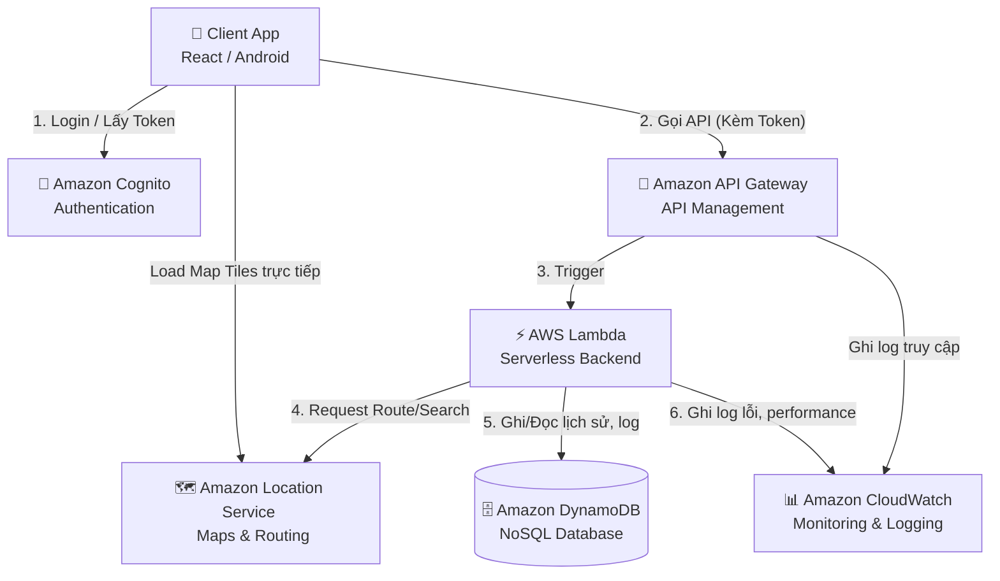

# BÁO CÁO THIẾT KẾ: HỆ THỐNG BẢN ĐỒ THÔNG MINH TRÊN AWS (Smart Map Cloud System)

## 1. MỤC TIÊU HỆ THỐNG
Hệ thống **Smart Map Cloud System** là ứng dụng bản đồ thông minh (hỗ trợ nền tảng Web/Mobile như React JS, Android) được xây dựng hoàn toàn dựa trên kiến trúc **Serverless** của Amazon Web Services (AWS). 

**Mục tiêu cốt lõi:**
- **Về tính năng:** Cung cấp trải nghiệm bản đồ mượt mà, cho phép người dùng tìm kiếm địa điểm, tìm đường đi (routing), lưu lại lịch sử di chuyển và các địa điểm yêu thích.
- **Về công nghệ Cloud:** Thể hiện rõ các đặc trưng của Điện toán đám mây:
  - **Serverless (Không máy chủ):** Không cần quản lý, duy trì server vật lý hay máy ảo (EC2).
  - **Auto-Scalability (Khả năng mở rộng tự động):** Hệ thống tự động scale up khi lượng người dùng tăng đột biến và scale down khi ít request để tối ưu chi phí (Pay-as-you-go).
  - **High Availability & Reliability:** Đảm bảo thời gian uptime cao, tích hợp giám sát và lưu vết (Monitoring & Logging) chặt chẽ.

---

## 2. KIẾN TRÚC HỆ THỐNG CLOUD

Kiến trúc hệ thống được thiết kế theo chuẩn Microservices và Serverless trên AWS.

### Sơ đồ kiến trúc (Architecture Flow)



### Vai trò của từng thành phần AWS:
1. **Amazon Location Service (Core Map):** Dịch vụ cung cấp bản đồ nền (Map tiles), Geocoding (Tìm kiếm địa chỉ) và Routing (Tìm đường đi). Đây là trái tim của ứng dụng bản đồ, thay thế cho Google Maps với chi phí linh hoạt hơn và tích hợp sâu với hệ sinh thái AWS.
2. **AWS Lambda (Backend Serverless):** Xử lý logic nghiệp vụ. Khi có request tìm đường từ user, Lambda sẽ gọi sang Location Service lấy kết quả, định dạng lại dữ liệu và trả về cho Client, đồng thời gọi DynamoDB để lưu lịch sử.
3. **Amazon API Gateway:** Cổng giao tiếp API, nhận request từ Mobile/Web, xác thực token (nếu có) và điều hướng (route) tới các function Lambda tương ứng. Giúp chống Spam request và quản lý rate limit.
4. **Amazon DynamoDB (Database NoSQL):** Nơi lưu trữ dữ liệu với tốc độ đọc ghi cực cao (millisecond). Phù hợp để lưu trữ dữ liệu dạng log, lịch sử di chuyển, tọa độ user mà không lo bị thắt cổ chai (bottleneck).
5. **Amazon CloudWatch & CloudTrail (Monitoring & Logging):** 
   - *CloudWatch:* Thu thập metrics (số lượng request, thời gian phản hồi của Lambda) và Logs (lịch sử lỗi).
   - *CloudTrail:* Lưu vết mọi hành động gọi API vào hệ thống AWS để audit.
6. **Amazon Cognito (Authentication):** Quản lý user đăng nhập/đăng ký. Cung cấp JWT Token bảo mật để gọi API.

---

## 3. CHỨC NĂNG CHÍNH CỦA HỆ THỐNG

1. **Tìm kiếm địa điểm (Geocoding / Places):** Người dùng nhập tên địa điểm, hệ thống trả về tọa độ (Lat, Long) và hiển thị ghim (pin) trên bản đồ.
2. **Tìm đường đi thông minh (Routing):** Tính toán và vẽ đường đi từ điểm A (Vị trí hiện tại) đến điểm B. Cung cấp thông tin khoảng cách và thời gian dự kiến.
3. **Lịch sử tìm kiếm & Di chuyển (Cloud Storage):** Mỗi khi user hoàn tất tìm đường, thông tin sẽ được tự động đồng bộ lên Cloud (DynamoDB). User có thể xem lại "Các chuyến đi gần đây" từ bất kỳ thiết bị nào.
4. **Địa điểm yêu thích (Saved Places):** Lưu và phân loại các địa điểm hay đến (Nhà, Công ty, Quán cafe).
5. **Gợi ý thông minh (Smart Suggestions):** Dựa vào dữ liệu lịch sử trong DB để gợi ý điểm đến khi user vừa mở app.

---

## 4. CLOUD LOGGING & DATA ANALYTICS (Điểm nhấn Cloud)

Đây là chức năng chứng minh sức mạnh của Điện toán đám mây so với ứng dụng chạy local thông thường.

### Luồng lưu Request Log:
Mỗi khi người dùng thực hiện thao tác **"Tìm đường"**, Lambda không chỉ trả về tuyến đường mà còn đóng gói một JSON Object bắn vào DynamoDB bảng `RouteHistoryLogs`:

```json
{
  "userId": "usr_12345",
  "requestId": "req_889900",
  "timestamp": "2024-05-20T10:30:00Z",
  "startPoint": {"lat": 10.762622, "lng": 106.660172, "name": "ĐH Khoa học Tự nhiên"},
  "endPoint": {"lat": 10.776889, "lng": 106.700806, "name": "Bitexco Financial Tower"},
  "distanceKm": 4.5,
  "clientDevice": "Android 14"
}
```

### Phân tích dữ liệu (Analytics):
Nhờ dữ liệu được cấu trúc trong DynamoDB, hệ thống có thể:
- **Thống kê điểm nóng (Hotspots):** Query Top 10 địa điểm được tìm kiếm nhiều nhất trong tháng.
- **Phân tích hành vi:** Nhận diện các tuyến đường có lưu lượng request cao vào giờ cao điểm, từ đó hệ thống có thể hiển thị cảnh báo kẹt xe mô phỏng.

---

## 5. HƯỚNG DẪN TRIỂN KHAI (IMPLEMENTATION PLAN)

Để xây dựng hệ thống này, các kỹ sư cần thực hiện theo các bước sau:

**Bước 1: Setup Cơ sở dữ liệu (DynamoDB)**
- Truy cập AWS Console -> DynamoDB. Tạo bảng `UserPlaces` (Partition key: `userId`, Sort key: `placeId`) và bảng `RouteHistoryLogs`.
- Set chế độ *On-Demand Capacity* để tự động scale không cần khai báo trước giới hạn.

**Bước 2: Cấu hình Amazon Location Service**
- Tạo một *Map resource* (chọn Style bản đồ như Esri Navigation).
- Tạo một *Place index resource* (để tìm địa điểm).
- Tạo một *Route calculator resource* (để tính toán đường đi).

**Bước 3: Viết Logic Backend (AWS Lambda)**
- Tạo Lambda function (Node.js hoặc Python/Kotlin).
- Cấp quyền (IAM Role) cho Lambda được phép truy cập vào DynamoDB và Location Service.
- Viết code gọi API tính đường đi của AWS SDK và code `putItem` vào DynamoDB.

**Bước 4: Expose API (API Gateway)**
- Tạo REST API trên API Gateway. Tạo resource `/route` với method `POST`.
- Tích hợp method này với Lambda function vừa tạo. Enable CORS để Client (Web/React) có thể gọi được.
- Deploy API và lấy URL endpoint cung cấp cho team Frontend/Mobile.

---

## 6. PHÂN TÍCH CLOUD (Tại sao chọn Serverless?)

Trong báo cáo bảo vệ đề tài, cần nhấn mạnh các giá trị sau để lấy điểm cao:

- **Vì sao dùng Serverless thay vì thuê Server ảo (EC2/VPS)?**
  - *Không tốn effort quản trị:* Team dev chỉ cần focus vào viết code (Lambda), AWS sẽ lo việc cài hệ điều hành, vá lỗi bảo mật, duy trì mạng.
  - *Scale Auto & Tức thì:* Nếu app được lên Tivi và có 10.000 người dùng cùng lúc, Lambda tự động đẻ ra 10.000 instance để xử lý mà không bị sập. Khi hết người dùng, nó tự tắt (Scale to zero).
  - *Tối ưu chi phí:* Serverless tính tiền theo số mili-giây code chạy. Không có user = Không tốn tiền ($0). Nếu dùng server truyền thống, bạn phải trả tiền thuê hàng tháng dù không ai dùng.

- **Vì sao dùng DynamoDB thay vì MySQL/SQL Server?**
  - Lịch sử request và log thường có cấu trúc thay đổi liên tục, dữ liệu phình to rất nhanh. NoSQL (DynamoDB) sinh ra để giải quyết bài toán Big Data với tốc độ read/write ổn định dưới 10ms dù bảng có hàng tỷ record.

---

## 7. KỊCH BẢN DEMO HỆ THỐNG

1. **Khởi động ứng dụng (Client):** 
   - Mở app Android/React. App sẽ render giao diện bản đồ (lấy tiles từ Amazon Location).
2. **Thực hiện thao tác:**
   - User nhập "Trường ĐH ABC" vào ô điểm đến. Nhấn "Tìm đường".
   - *Flow hiển thị:* Khán giả sẽ thấy app gọi API -> Lambda -> Location Service -> vẽ đường đi lên bản đồ.
3. **Chứng minh Cloud (Mở AWS Console):**
   - Mở DynamoDB -> Tab *Explore item*: Cho thầy cô thấy dòng dữ liệu lịch sử tìm kiếm vừa được hệ thống tự động ghi nhận ngay lập tức.
   - Mở CloudWatch -> Tab *Log groups*: Cho thấy log truy cập và hiệu năng chạy của hàm Lambda.

---

## 8. TÍNH NĂNG BONUS (MỞ RỘNG ĐỂ ĐẠT ĐIỂM TUYỆT ĐỐI)

- **Tracking vị trí Realtime:** Sử dụng dịch vụ **Amazon Location Tracker**. Gửi tọa độ GPS của điện thoại lên AWS mỗi 5 giây qua MQTT (AWS IoT Core). Cập nhật vị trí của user trên bản đồ theo thời gian thực (Giống app Grab).
- **Phân quyền nâng cao:** Dùng Cognito, chia role Admin (được xem mọi thống kê) và User thường (chỉ xem được lịch sử của mình).

---
**TỔNG KẾT:** Đề tài này không chỉ dừng lại ở mức "làm app bản đồ" mà là một hệ thống thể hiện tư duy **Cloud-Native**. Bằng cách vận dụng Serverless, hệ thống đạt được sự tối ưu về mọi mặt: Chi phí, hiệu năng, bảo trì và khả năng mở rộng không giới hạn.
